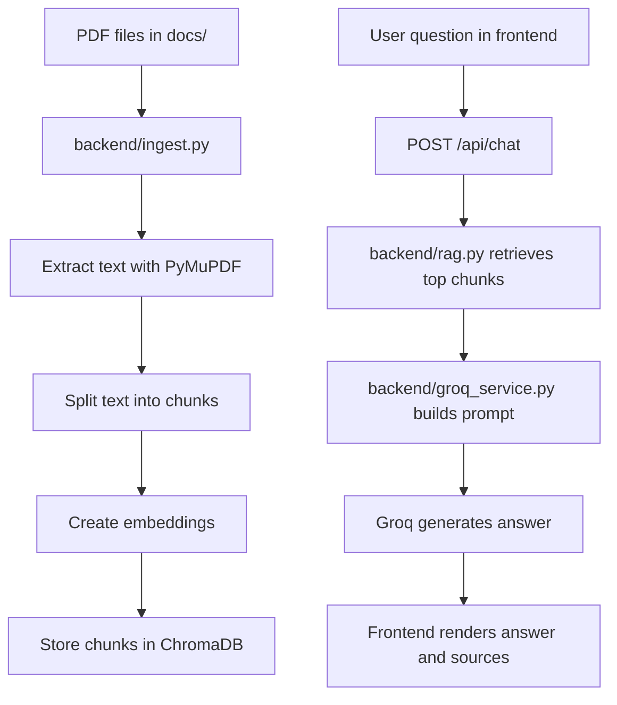

# RAG AI Document Hub

A Retrieval-Augmented Generation (RAG) application that answers questions from a local PDF document corpus using a FastAPI backend, ChromaDB vector search, and a React + Vite frontend.

## Overview

This project turns a set of PDF documents into a searchable knowledge base. The backend extracts text from PDFs, splits it into chunks, creates embeddings, stores those chunks in ChromaDB, retrieves the most relevant passages for each user question, and sends the retrieved context to Groq for answer generation.

The frontend provides a clean chat interface where users can ask policy-related questions and receive grounded answers with source documents.

## Features

- PDF ingestion from the `docs/` folder
- Text extraction with PyMuPDF
- Chunking with `RecursiveCharacterTextSplitter`
- Embeddings with `sentence-transformers/all-MiniLM-L6-v2`
- Local vector storage with ChromaDB
- Retrieval of the top matching chunks for each query
- Answer generation with Groq
- FastAPI backend with a single chat endpoint
- React + Vite frontend chat UI
- Suggested question chips
- Loading states, error handling, and source display

## Project Structure

```text
Ragnostic/
├── README.md
├── requirements.txt
├── docs/
│   ├── RAGnostic-Benefits-Compensation.pdf
│   ├── RAGnostic-Code-of-Conduct.pdf
│   ├── RAGnostic-Company-Overview.pdf
│   ├── RAGnostic-HR-Policy.pdf
│   ├── RAGnostic-IT-Security-Policy.pdf
│   ├── RAGnostic-Leave-Policy.pdf
│   ├── RAGnostic-Performance-Review.pdf
│   ├── RAGnostic-Resignation-Policy.pdf
│   └── RAGnostic-Work-From-Home-Policy.pdf
├── backend/
│   ├── main.py
│   ├── rag.py
│   ├── ingest.py
│   ├── groq_service.py
│   ├── retrieval_test.py
│   ├── requirements.txt
│   ├── chroma_db/
│   └── venv/
└── frontend/
    ├── index.html
    ├── package.json
    ├── vite.config.js
    └── src/
        ├── App.jsx
        ├── App.css
        ├── main.jsx
        └── components/
            ├── ChatWindow.jsx
            ├── ChatInput.jsx
            ├── MessageBubble.jsx
            └── QuestionChips.jsx
```

## Tech Stack

### Backend

- FastAPI
- Uvicorn
- ChromaDB
- PyMuPDF
- sentence-transformers
- langchain-text-splitters
- Groq Python SDK
- python-dotenv
- Pydantic

### Frontend

- React
- Vite
- Axios

## How It Works



## Prerequisites

- Python 3.10 or newer
- Node.js 18 or newer
- npm
- A Groq API key
- PDF documents placed in the `docs/` folder

## Environment Variables

Create a `.env` file in the repository root:

```env
GROQ_API_KEY=your_groq_api_key_here
```

Optional frontend override:

```env
VITE_API_BASE_URL=http://localhost:8000
```

## Backend Setup

### 1. Create or activate the Python virtual environment

If the repository already contains `backend/venv`, activate it:

```powershell
cd D:\Codes\Ragnostic\backend
.\venv\Scripts\Activate.ps1
```

If you are starting from a fresh clone and the virtual environment does not exist yet, create one:

```powershell
cd D:\Codes\Ragnostic\backend
python -m venv venv
.\venv\Scripts\Activate.ps1
```

### 2. Install Python dependencies

Install from the repository root requirements file:

```powershell
cd D:\Codes\Ragnostic
pip install -r requirements.txt
```

If you prefer, you can also install from `backend/requirements.txt` because it contains the same backend dependencies.

### 3. Add your documents

Place the PDF files you want the assistant to use in the `docs/` folder.

The current repository includes these sample documents:

- `RAGnostic-Benefits-Compensation.pdf`
- `RAGnostic-Code-of-Conduct.pdf`
- `RAGnostic-Company-Overview.pdf`
- `RAGnostic-HR-Policy.pdf`
- `RAGnostic-IT-Security-Policy.pdf`
- `RAGnostic-Leave-Policy.pdf`
- `RAGnostic-Performance-Review.pdf`
- `RAGnostic-Resignation-Policy.pdf`
- `RAGnostic-Work-From-Home-Policy.pdf`

### 4. Build the ChromaDB index

Run ingestion once after the PDFs are in place:

```powershell
cd D:\Codes\Ragnostic
python backend\ingest.py
```

This will:

- Read all PDFs from `docs/`
- Extract text page by page
- Chunk the text into overlapping pieces
- Generate embeddings with `all-MiniLM-L6-v2`
- Store chunks and metadata in `backend/chroma_db/`

### 5. Start the backend API

Use the venv Python executable directly to avoid launcher path issues on Windows:

```powershell
cd D:\Codes\Ragnostic\backend
.\venv\Scripts\python.exe -m uvicorn main:app --reload
```

The API will run at:

```text
http://127.0.0.1:8000
```

## Frontend Setup

### 1. Install frontend dependencies

```powershell
cd D:\Codes\Ragnostic\frontend
npm install
```

### 2. Start the frontend

```powershell
npm run dev
```

The Vite app will usually open at:

```text
http://localhost:5173
```

## Full Run Order

Use two terminals:

### Terminal 1: Backend

```powershell
cd D:\Codes\Ragnostic\backend
.\venv\Scripts\Activate.ps1
.\venv\Scripts\python.exe -m uvicorn main:app --reload
```

### Terminal 2: Frontend

```powershell
cd D:\Codes\Ragnostic\frontend
npm run dev
```

If you update the PDF files later, rerun:

```powershell
python backend\ingest.py
```

before restarting the backend.

## API Reference

### Health Check

```http
GET /
```

Response:

```json
{
  "status": "ok"
}
```

### Chat Endpoint

```http
POST /api/chat
```

Request body:

```json
{
  "question": "What is the leave policy?"
}
```

Response body:

```json
{
  "answer": "...",
  "sources": ["RAGnostic-Leave-Policy.pdf"]
}
```

## Ingestion Script

Run the ingestion script when:

- You add new PDFs
- You replace existing PDFs
- You want to rebuild the vector index from scratch

Command:

```powershell
python backend\ingest.py
```

The script uses these key settings:

- `chunk_size = 500`
- `chunk_overlap = 50`
- `top_k = 4` for retrieval
- `all-MiniLM-L6-v2` for embeddings

## Retrieval Smoke Test

A small retrieval test is available:

```powershell
cd D:\Codes\Ragnostic\backend
python retrieval_test.py
```

This prints the top retrieved chunks for a sample policy question so you can verify that the vector store is working.

## Important Behavior

- The assistant answers only from retrieved document context
- If the answer is not in the retrieved context, it falls back to a generic refusal
- Source document names are returned with each answer
- The frontend shows loading and error states
- The backend loads `.env` from the repository root

## Troubleshooting

### `uvicorn main:app --reload` fails with a launcher path error

Use the venv Python module form instead:

```powershell
.\venv\Scripts\python.exe -m uvicorn main:app --reload
```

### ChromaDB is missing or stale

Delete the generated database folder and rerun ingestion:

```powershell
Remove-Item -Recurse -Force backend\chroma_db
python backend\ingest.py
```

### No documents are found

Make sure the PDF files exist in `docs/` and that they have the `.pdf` extension.

### Groq API key errors

Verify that `GROQ_API_KEY` is set in the `.env` file at the repository root.

### Frontend cannot reach the backend

Confirm that the backend is running on `http://127.0.0.1:8000` and that the frontend is pointing to the same URL.

## GitHub Notes

For GitHub, you typically want to keep only the source files and document corpus in the repository.

Do not commit generated local artifacts such as:

- `frontend/node_modules/`
- `backend/venv/`
- `backend/__pycache__/`
- Temporary build outputs

The ChromaDB folder under `backend/chroma_db/` is generated from ingestion. If you want the repository to be lightweight, you can remove it before publishing and document that users should run `python backend/ingest.py` after cloning.

## License

Internal project. Add a license if you want the repository to be public.
