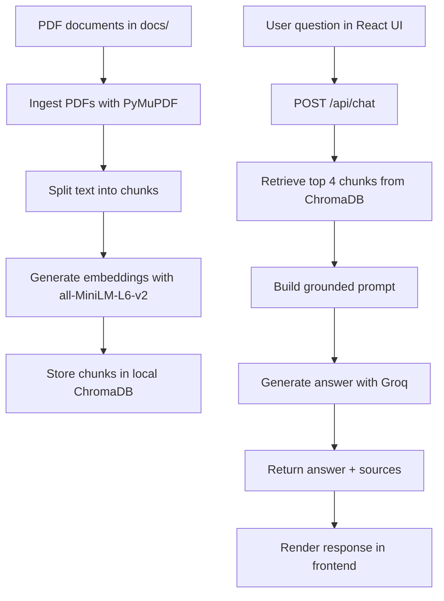

# RAG AI Document Hub

A Retrieval-Augmented Generation (RAG) chatbot that answers questions using only the document corpus you place in the `docs/` folder.

## Overview

This project ingests policy PDFs, chunks and embeds the content, stores vectors in ChromaDB, retrieves the most relevant passages for a user query, and generates a grounded answer with a large language model.

The application is split into two parts:

- `backend/` - FastAPI service, document ingestion, retrieval, and answer generation
- `frontend/` - React + Vite chat interface

## Features

- PDF ingestion from the `docs/` folder
- Text extraction with PyMuPDF
- Chunking with `RecursiveCharacterTextSplitter`
- Local ChromaDB persistence
- Embeddings with `sentence-transformers/all-MiniLM-L6-v2`
- Retrieval of the top 4 relevant chunks
- Grounded answer generation with Groq
- FastAPI endpoint at `POST /api/chat`
- Responsive React frontend
- Suggested question chips
- Loading spinner and source display
- Graceful API error handling

## Workflow Diagram



## Project Structure

```text
project/
├── docs/
├── backend/
│   ├── ingest.py
│   ├── rag.py
│   ├── groq_service.py
│   ├── retrieval_test.py
│   ├── main.py
│   └── chroma_db/
├── frontend/
│   ├── index.html
│   ├── package.json
│   ├── vite.config.js
│   └── src/
│       ├── App.jsx
│       ├── App.css
│       ├── main.jsx
│       └── components/
│           ├── ChatWindow.jsx
│           ├── ChatInput.jsx
│           ├── MessageBubble.jsx
│           └── QuestionChips.jsx
├── requirements.txt
└── README.md
```

## Backend

### Main API

- `POST /api/chat`

Request:

```json
{
  "question": "string"
}
```

Response:

```json
{
  "answer": "string",
  "sources": ["file1.pdf", "file2.pdf"]
}
```

### Ingestion Pipeline

Run the ingestion script to process the PDFs and build the local vector database:

```bash
cd backend
python ingest.py
```

What it does:

- Reads all PDF files from `docs/`
- Extracts text using PyMuPDF
- Splits text into chunks with:
  - `chunk_size = 500`
  - `chunk_overlap = 50`
- Creates embeddings using `all-MiniLM-L6-v2`
- Stores chunk text and metadata in local ChromaDB

### Retrieval Test

A lightweight smoke test is available:

```bash
cd backend
python retrieval_test.py
```

This prints the top 4 retrieved chunks for:

```text
What topics are covered in the documents?
```

### Environment Variables

Create a `.env` file in the repository root:

```env
GROQ_API_KEY=your_groq_api_key_here
```

## Frontend

The frontend is a React application built with Vite.

Run it with:

```bash
cd frontend
npm install
npm run dev
```

By default, the frontend expects the backend at:

```text
http://localhost:8000
```

You can override this with:

```env
VITE_API_BASE_URL=http://localhost:8000
```

## Setup

### 1. Install Python Dependencies

```bash
pip install -r requirements.txt
```

### 2. Prepare Documents

Place your PDF documents in the `docs/` folder.

### 3. Ingest Documents

```bash
cd backend
python ingest.py
```

### 4. Start the Backend

```bash
cd backend
uvicorn main:app --reload
```

### 5. Start the Frontend

```bash
cd frontend
npm install
npm run dev
```

## Notes on Git Tracking

This README is not ignored by `.gitignore`, so it will be included automatically the next time you run:

```bash
git add README.md
```

Or, to stage everything changed:

```bash
git add .
```

## Important Behavior

- The assistant answers only from retrieved document context
- If the answer is not found in the document context, the fallback response is:

```text
I don't have that information in the document context.
```

- Source documents are returned with each answer
- The frontend shows loading state while waiting for the API

## Troubleshooting

### No documents are found

Make sure the PDF files exist in `docs/` and have the `.pdf` extension.

### ChromaDB errors

Delete the local Chroma database folder and re-run ingestion:

```bash
rm -rf backend/chroma_db
python backend/ingest.py
```

### API key errors

Verify `GROQ_API_KEY` is defined in `.env` and that the file is in the project root.

## License

Internal assessment project. Add a license here if needed.
